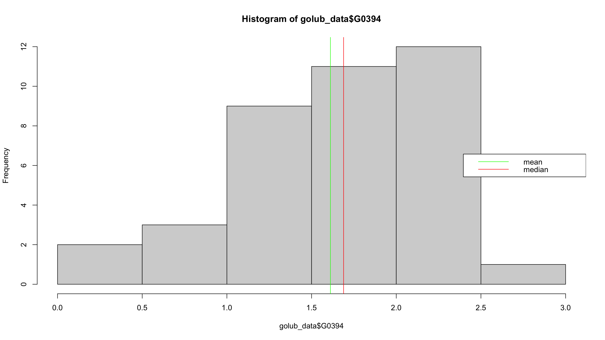

```{r setup, include=FALSE}
knitr::opts_chunk$set(error = TRUE)
```
<style>
.exercise{background-color:#c9e2a5;padding:1ex 1ex .1ex 1ex;margin-top:1em}
.answer{background-color:#f3f3a5;padding:1ex 1ex .1ex 1ex}
h1 {margin-top:5em}
h2 {margin-top:3em}
hr {border:2px solid gray}
</style>

__Exam Formalities__

* The assignment is to be completed individually and without any help from others.
Cheating (including working in groups) is forbidden.
* You need to submit __one single PDF file__ with all your solutions to the exam problems.
    - The PDF file must contain all written answers,
mathematical derivations, R code, and figures.
    - You may include legible scans/photos,
for example, of handwritten derivations
(which can be accomplished in Rmd via
``). \
    - Yet, the preferable and easiest way is to __prepare your solutions
in Rmarkdown__ to produce your PDF.
    - You may download the .Rmd file of this exam assignment sheet (top-right corner of the .html file) as a template;
open the .Rmd file in RStudio;
  fill in your name at the top;

      ::: {.answer}
      place your solutions inside the respective
      answer blocks between `::: answer :::` and `:::`;
      :::

      and knit to PDF
(in the RStudio editor toolbar click to expand the "Knit" dropdown menu and select "Knit to PDF")
to prepare your submission. \
    - Refer to the Exam Knit Test (cf. Absalon) for possible solutions to common knitting problems. \
<small>(As fallback, you may knit to HTML / DOC, open the resulting document, and convert this document to PDF via "print to PDF"; take extra care to double check that the resulting PDF is complete and looks as intended.)</small>
* Clearly indicate which question you are answering and __formulate complete
answers with justifications__, that is, only stating a code block in the PDF
and its output is not sufficient and does not earn points.
For example, if in Problem 12 you were given a sample of $n$ iid copies of a
random variable $X$ and asked to provide a point estimate of its expected
value, then the following

    > ```
    > > mean(data)
    > [1] 39.183
    > ```
    
    is insufficient and a better alternative could be
    
    > _Answer to Problem 12_
    >
    > The empirical average is a point estimator of the expected value. We use R to calculate the empirical average of the given sample and print the result below
    > ```
    > > mean(data)
    > [1] 39.183
    > ```
    
    The code in the above example is arguably self-explanatory as it is a single code line calling a single command with a self-explanatory name, `mean`. Longer code blocks are usually not self-explanatory. Do not rely on the reader of your report having to guess what you are trying to achieve/show in a table/illustrate with a plot/implement, but instead __provide complete self-contained answers with text+code+output__.
* __Always explain and justify all your answers, and explain and document code.__
* If you find a problem with any of the problem statements,
please clearly state and describe so in your solution
and explicate how you proceeded henceforth.
* In case you cannot completely solve a problem, write down your
ideas and briefly outline your approach – correct ideas may earn
you partial points.
* If you use R packages that are neither part of the base R distribution nor have been introduced during the course for (the solutions of) the weekly exercises, you are responsible for these packages to work correctly.
* Always make sure to __double check your PDF before submitting__ it.

__Data__

The data to be used in the exam can be downloaded from Absalon.
The file is named `exam202425.RData`
and you can load the data by opening aforementioned file with RStudio
or using the load function `load("exam202425.RData")`.


\pagebreak
# Problem 0: Presentation [3]

Up to three points can be earned for the presentation, that is,
for example, for a well formatted PDF, for an overall self-contained, well structured report with figure legends and annotations, for well documented code, for technical precision in statistical statements and assumptions.


\pagebreak
# Problem 1: Molecular Classification of Cancer [10]
The data for this exercise is due to Golub et al. (1999)
who investigated gene expression levels from 38 bone marrow samples,
27 with
acute lymphoblastic leukemia (ALL)
and 11 with
acute myeloid leukemia (AML).

This data set records the following variables:

* `golub_data$cl`: The tumor class, ALL is coded as 0 and AML as 1.
* `golub_data$G0394`: Gene expression level of gene 394
* `golub_data$G2037`: Gene expression level of gene 2037
* `golub_data$G2315`: Gene expression level of gene 2315
* `golub_data$G2316`: Gene expression level of gene 2316
* `golub_data$G2560`: Gene expression level of gene 2560

We show the head of the data frame and a histogram below (the full data `golub_data` is not needed to answer the questions and not provided in the exam RData file).

``` {r}
load("exam202425.RData")
# only the head is provided in the RData file
head(golub_head)
```




## Problem 1.1 [3]

::: exercise :::
Based on the provided information, state whether more than 60% of the observations of the gene expression level of gene 394 were between 1 and 2.
Explain and justify your answer by explicitly referring to certain aspects of the provided information that you are basing your answer on and fleshing out your calculation and line of argument.
Are you missing any information to answer the question? Explain.
:::

::: answer :::
According to the image histogram of golub_data$G0394, the frequency of gene expression levels between 1 and 2 is roughly 9 plus 11, for a total of 20, which is roughly `52.63%` of the 38 total samples, which is smaller than 60%.
```{r}
(9+11)/38
```
Therefore, regarding the question given in the title, the answer is no. There is no missing information to answer the question.

:::


## Problem 1.2 [7]

Now consider the following model summary:
``` {r}
load("exam202425.RData")
writeLines(golub_model_summary)
```
::: exercise :::
1. Based on the above model summary discuss whether and how you may simplify the model
and justify your answer by referring to the information in the model summary.
For any statistical test involved in your answer, explicitly and formally state the null hypothesis.

2. For simplicity, round coefficients to 1 decimal (that is, $-2.288575$ would be rounded to $-2.3$) for answering this part of the question. \
Using the model with summary provided above, predict the tumor class for the following synthetic test cases:
``` {r}
test_cases <- data.frame(G2037=c(-1, -1, 1, 1), G2560=c(-1, 1, -1, 1), predicted_class=c(NA, NA, NA, NA))
test_cases
```
Discuss how you calculate and arrive at your prediction and fill in the column `predicted_class` with either of the two tumor class labels `AML` or `ALL` accordingly. Print the `test_cases` data frame including the updated `predicted_class` column, which now contains the predicted class labels (`AML` or `ALL`) instead of `NA` values.

3. Define a data frame `zerodf` such that executing `predict(model, newdata = zerodf)` in R results in __exactly__ the following output being printed
```
1
0
```

4. Is it possible to provide confidence intervals for the coefficient estimates based on the provided information?
If yes, provide the confidence intervals, explain your reasoning, and justify your choice.
If no, explain your reasoning why the provided information is not enough.
:::

::: answer :::
### Task 1.  

The model provided in the question is (using `-1` to indicate no intercept):


$$\text{logit}(\Pr(\text{cl} = 1)) 
= \beta_{G2037} \cdot \text{G2037} 
+ \beta_{G2560} \cdot \text{G2560}.$$

From the model summary:
The coefficient of G2037 $\beta_{G2037}$ is estimated to be approximately 0.5916 with a p-value of 0.329640 (> 0.05), which is not statistically significant at common significance levels.

As a result, G2037 does not provide significant predictive value for classification (ALL vs. AML). Therefore, it is reasonable to consider simplifying the model by removing the non-significant variable G2037, leaving only G2560:

$$
\text{logit}(\Pr(\text{cl} = 1)) 
= \beta_{G2560} \cdot \text{G2560}.
$$

To formally assess whether G2037 can be removed, a likelihood ratio test (LRT) can be performed to compare the \"full model\" with the \"reduced model\" that excludes G2037.

- Null hypothesis $H_0$: including G2037 in the model does not significantly improve model fit.
- Alternative hypothesis $H_1$: G2037 significantly improves the model.

### Task 2.

From the model summary, we use:

$\hat{\beta}_{G2037} \approx 0.6$

$\hat{\beta}_{G2560} \approx 1.3$

As a result, the linear predictor $\eta$:

$$
\eta = 0.6 \times G2037 + 1.3 \times G2560.
$$

Next, we calculate the predicted probability $\hat{p}$ using the logistic function:

$$
\hat{p} = \frac{ e^\eta }{1 + e^\eta }.
$$

Finally, we compare $\hat{p}$ with 0.5:
- If $\hat{p} > 0.5$, the predicted class is AML.
- Otherwise, the predicted class is ALL.

We calculate $\eta$, $\hat{p}$, and the predicted class for each case:

Case 1

$\eta = 0.6 \times (-1) + 1.3 \times (-1) = -0.6 - 1.3 = -1.9$

$\hat{p} = \frac{e^{-1.9}}{1 + e^{-1.9}} \approx 0.13$

$\hat{p} = 0.13 < 0.5 $  

$\implies$ Predicted class: ALL.

Case 2

$\eta = 0.6 \times (-1) + 1.3 \times 1 = -0.6 + 1.3 = 0.7$

$\hat{p} = \frac{e^{0.7}}{1 + e^{0.7}} \approx 0.67$

$\hat{p} = 0.67 > 0.5$  

$\implies$ Predicted class: AML.


Case 3

$\eta = 0.6 \times 1 + 1.3 \times (-1) = 0.6 - 1.3 = -0.7$

$\hat{p} = \frac{e^{-0.7}}{1 + e^{-0.7}} \approx 0.33$

$\hat{p} = 0.33 < 0.5 $  

$\implies$ Predicted class: ALL.

Case 4

$\eta = 0.6 \times 1 + 1.3 \times 1 = 0.6 + 1.3 = 1.9$

$\hat{p} = \frac{e^{1.9}}{1 + e^{1.9}} \approx 0.87$

$\hat{p} = 0.87 > 0.5 $  

$\implies$ Predicted class: AML.

Add them to data frame:
```{r}
test_cases$predicted_class <- c("ALL", "AML", "ALL", "AML")
test_cases
```
### Task 3.
```{r}
# Define a logistic regression model
suppressWarnings({
  model <- glm(
    formula = cl ~ -1 + G2037 + G2560,
    family = binomial,
    data = data.frame(
      G2037 = c(1, -1, 2, -2), 
      G2560 = c(1, -1, 2, -2),
      cl = c(1, 0, 1, 0)
    )
  )
})

# Define zerodf
zerodf <- data.frame(
  G2037 = c(2, -2),  # Input values for prediction
  G2560 = c(1, -1)
)

# Predict probabilities and convert to class labels#, type = "response"
suppressWarnings({
  predicted_prob <- predict(model, newdata = zerodf)
  predicted_class <- ifelse(predicted_prob > 0.5, 1, 0)
})

predicted_class
```
The program has output 0, 1. 1, 2 above are indexes. Please ignore.

### Task 4.
The provided information is sufficient to calculate confidence intervals:
From the problem statement and the model summary:

$$
\hat{\beta}_{G2037} = 0.5916, \; \text{SE} = 0.6069 \\
\hat{\beta}_{G2560} = 1.3351, \; \text{SE} = 0.3956
$$


Confidence intervals for coefficients are typically calculated using the standard normal distribution:

$$
C_n = \left( \bar{X} - SEM \times z_{0.975}, ; \bar{X} + SEM \times z_{0.975} \right)
$$

Using the formula, according to slides in week4_a:

\[
CI_{G2037} = \hat{\beta}_{G2037} \pm 1.96 \cdot SE_{G2037},
\]
\[
CI_{G2560} = \hat{\beta}_{G2560} \pm 1.96 \cdot SE_{G2560}.
\]

For G2037:
$$
\text{CI}_{G2037} = 0.5916 \pm 1.96 \cdot 0.6069
$$
$$
\text{Lower Bound} = 0.5916 - 1.96 \cdot 0.6069 \approx -0.5995,
$$
$$
\text{Upper Bound} = 0.5916 + 1.96 \cdot 0.6069 \approx 1.7827.
$$
$$
\text{CI}_{G2037} = (-0.60, 1.78)
$$

For G2560:
$$
\text{CI}_{G2560} = 1.3351 \pm 1.96 \cdot 0.3956
$$
$$
\text{Lower Bound} = 1.3351 - 1.96 \cdot 0.3956 \approx 0.5594,
$$
$$
\text{Upper Bound} = 1.3351 + 1.96 \cdot 0.3956 \approx 2.1108.
$$
$$
\text{CI}_{G2560} = (0.56, 2.11)
$$

As a result:  
The 95% confidence interval for $G2037$ is approximately $(-0.60, 1.78)$.  
The 95% confidence interval for $G2560$ is approximately $(0.56, 2.11)$.

:::


\pagebreak
# Problem 2: Probability Theory [20]

In this problem, you will work with a sample space $\Omega = \{1, ..., 5000\}$ and events and random variables defined on top of that.

In Problem 2.1 you will define the probability distribution $P$ on $\Omega$ you will be working with throughout all of 2.2--2.6. \
<small>(As a fallback, if you have not completed 2.1 to define your probability distribution but need it in later parts, you may consider the probability distribution $P$ on $\Omega=\{1,...,5000\}$ defined for each $\omega\in\Omega$ via `function(w) (w %% 250) / 622500` instead to earn partial points based on that.)</small>


## Problem 2.1: Setting up [4]

::: exercise :::
Set the variable `mynumber` to the 3-digit strictly positive integer number in your KU student email address,
that is, if your KU email address is `abc123@alumni.ku.dk` (or `abc123@ku.dk`) set `mynumber <- 123`. \
<small>
(As a fallback and only if you do not have a KU email address, set `mynumber` to the product of the number of letters in your first name times the number of letters in your last name, and if the resulting number has less than three digits, append a 7, that is, Quinn Sky would set `mynumber <- 157`.)
</small>
:::

::: answer :::
```{r}
#my ku email xdn631@alumni.ku.dk
mynumber <- 631
mynumber
```
:::

\

To define the probability distribution $P$ on $\Omega$ you will be working with throughout this exercise,
we will define $P(\omega)$ for each elementary event $\omega \in \Omega$.
For this, we provide the function `setup_omega` (as part of the RData file) which will generate a data frame that specifies the probability distribution on the sample space $\{1,...,5000\}$.

---

Example to illustrate how the data frame returned by `setup_omega` defines a probability distribution on $\Omega$. Your numbers and probability distribution will be different, this is just to illustrate the data frame.

The function `setup_omega` returns a data frame with columns "element",
"nnp" for non-normalized probability, "X", and "Z".
The table you obtain for your `mynumber` may look something like the following (but with different numbers):
```{r}
load("exam202425.RData")
dummy <- setup_omega(594)
head(dummy)
```
For each element $\omega\in\Omega=\{1,...,5000\}$ as stated in column "element"
the data frame specifies the non-normalized probability as stated in column "nnp",
that is, in the above example,
the probability of the event $\{1\}$ would be proportional to $62$,
and the probabiity of the event $\{2\}$ divided by the probability of the event $\{1\}$
would be equal to $\frac{124}{62} = 2$.

---

::: exercise :::
To obtain the definition of your probability distribution $P$ on $\Omega$,
call the function `setup_omega` for your number from above, that is, `setup_omega(mynumber)`,
and add a column "p" that holds the normalized probability $P(\omega)$.
:::

::: answer :::
Use following formula to calculate normalized probability $P(\omega)$  
For each $\omega$:
$$
P(\omega) = \frac{\text{nnp}(\omega)}{\sum_{\omega' \in \omega} \text{nnp}(\omega')}.
$$
``` {r}
omega_df <- setup_omega(mynumber)
#calculate sum of nnp
nnp_sum <- sum(omega_df$nnp)
#add column p = nnp / nnp_sum
omega_df$p <- omega_df$nnp / nnp_sum
```
:::

::: exercise :::
Calculate $P(A)$, $P(B)$, $P(A\cup B)$, $P(A,B)$, and $P(A\mid B)$ for $A = \{1, 10, 100, 1000\}$ and $B = \{2, 20, 200, 2000\}$ for your probability distribution $P$ defined via `setup_omega(mynumber)$nnp`.

__State the exact results as fraction__, that is, for example $\frac{1}{3}$ instead of the decimal $0.3333333$ (the decimal is often not exact but rounded or truncated, so avoid decimals in your intermediate calculations, for example, $\frac{5}{43}\cdot\frac{(2+3)}{43} = \frac{25}{43^2} = \frac{25}{1849}$ is exact, while `(5/43)*((2+3)/43)` would yield `0.01352082` which is close to but not equal to the exact answer).

Hint: We provide the column "nnp". Explicitly handle the normalizing constant instead of working with the normalized probability.
:::

::: answer :::
```{r}
A <- c(1, 10, 100, 1000)
B <- c(2, 20, 200, 2000)
```
Here we calculate the nnp sum of A and B. In order to have a fractions result, we cannot use p column we obtained in 2.1.
```{r}
S_A <- sum(omega_df$nnp[omega_df$element %in% A])
S_B <- sum(omega_df$nnp[omega_df$element %in% B])
```
The problem defines:

$$
A = {1, 10, 100, 1000}, \quad B = {2, 20, 200, 2000}.
$$

If you inspect these two sets, you will find that they have no common elements. 
```{r}
nnp_A <- omega_df$nnp[omega_df$element %in% A]
nnp_B <- omega_df$nnp[omega_df$element %in% B]

intersection <- intersect(nnp_A, nnp_B)

if (length(intersection) > 0) {
  print("Two vectors have intersection")
  print(intersection)
} else {
  print("Two vectors do not intersect")
}
```


Therefore:

$$
A \cap B = \emptyset.
$$

This means that:

$$
P(A \cap B) = 0, \quad P(A \mid B) = \frac{P(A \cap B)}{P(B)} = 0.
$$
Also, count of $A \cup B$ is $S_A + S_B - S_{A \cap B}$
```{r}
S_AiB <- 0 

S_AuB <- S_A + S_B - S_AiB
```
To state the exact results as fraction, we introduce MASS.  
The probability required can be calculated as follow:  

- $P(A) = \frac{S_A}{S_\omega}$  

- $P(B) = \frac{S_B}{S_\omega}$  

- $P(A \cup B) = \frac{S_A + S_B}{S_\omega}, \text{ because } A \cap B = \emptyset$  
- $P(A, B) = P(A \cap B) = 0$  

- $P(A \mid B) = \frac{P(A \cap B)}{P(B)} = \frac{0}{P(B)} = 0$  

```{r}
library(MASS)

P_A <- fractions(S_A / nnp_sum)
P_B <- fractions(S_B / nnp_sum)
P_AuB <- fractions(S_AuB / nnp_sum)
P_AiB <- fractions(S_AiB / nnp_sum)
P_A_given_B <- fractions(0 / (S_B / nnp_sum))

P_A
P_B
P_AuB
P_AiB
P_A_given_B
```
Accoring to the result:

- $P(A) = \frac{S_A}{S_\omega}=329/355051$  

- $P(B) = \frac{S_B}{S_\omega}=26/46311$  

- $P(A \cup B) = \frac{S_A + S_B}{S_\omega}= 1585/1065153$  

- $P(A, B) = P(A \cap B) = 0$  

- $P(A \mid B) = \frac{P(A \cap B)}{P(B)} = \frac{0}{P(B)} = 0$  

:::


## Problem 2.2: Valid probability distribution [2]

::: exercise :::
State 4 properties that a probability distribution must satisfy.
For each property, provide a numerical example that illustrates that the property is met by your probability distribution $P$ defined in 2.1, that is, define some events and evaluate the probabilities to illustrate the properties of a valid probability distribution.
:::

::: answer :::
There are 4 properties that a probability distribution, which are:  

- $0 \leq P(\omega) \leq 1$ for every event $\omega$  

- If $\{\omega_i, i \geq 1\}$ are disjoint $(\omega_i \cap \omega_j = \emptyset, i \neq j)$, then 
$$
P\left(\bigcup_{i=1}^{\infty} \omega_i\right) = \sum_{i=1}^{\infty} P(\omega_i)
$$  

- $P(\omega) = 1$  $P(\emptyset) = 0$  

- $P(\omega^c) = 1 - P(\omega)$  

***

#### Property 1. $0 \leq P(\omega) \leq 1$ for every event $\omega$  
```{r}
is_positive <- function(x) {
  return(x >= 0 & x <= 1)
}
all_positive <- all(sapply(omega_df$p, is_positive))
all_positive
```
We iterate over all the elements on column $p$ to determine if they are in the interval 0 and 1. And the results says true. So distribution $P$ fits property 1. 

***

#### Property 2.
```{r}

S_A <- sum(omega_df$nnp[omega_df$element %in% A])
P_A <- S_A / nnp_sum

S_B <- sum(omega_df$nnp[omega_df$element %in% B])
P_B <- S_B / nnp_sum

AuB <- union(A, B)
S_AuB <- sum(omega_df$nnp[omega_df$element %in% AuB])
P_AuB <- S_AuB / nnp_sum

cat("P(A∪B) =", P_AuB, " vs. P(A) + P(B) =", P_A + P_B, "\n")
```
Here we have taken two disjoint sets `A`, `B` and computed their joint probabilities and the product of their respective probabilities, proving that the two probabilities are equal. So distribution $P$ fits property 2.

***
#### Property 3. $P(\omega) = 1$  $P(\emptyset) = 0$ 
```{r}
P_Omega_check <- sum(omega_df$p)
isTRUE(all.equal(P_Omega_check, 1))
```
Here, we add all elements in `omega_df$p`, and the result is equal to 1. Also, we know that $P(\emptyset)$ is always equal to 0. So distribution $P$ fits property 3.

***
#### Property 4. $P(\omega^c) = 1 - P(\omega)$  
```{r}
A <- c(1)
B <- c(2:5000)

P_A <- sum(omega_df$p[omega_df$element %in% A])
P_B <- sum(omega_df$p[omega_df$element %in% B])

isTRUE(all.equal(P_A, 1-P_B))
```
Here, I computed the set A, which has only one element, and its complement B in the `omega_df` dataset, and the results show that they are both equal.So distribution $P$ fits property 4.

As a result, all properties are met by my probability distribution $P$ defined in 2.1.
:::


## Problem 2.3: Independent events [6]

::: exercise :::
Define two events $D \subset \Omega$ and $E \subset \Omega$ that are independent under your probability distribution $P$ defined in 2.1.
You have to choose $D$ and $E$ such that neither of the two sets is the empty set or equal to $\Omega$, that is, $D$ and $E$ have to contain at least one element but cannot contain all elements.

If you conclude that such events do not exist, provide a rigorous argument and demonstration for why such events do not exist.

If you conclude that such events exist, explain the reasoning of how you found those events: How did you arrive at those two events, what considerations went into the search, did you use some R code to help screen for events, ...?
Demonstrate that the $D$ and $E$ you propose are indeed independent by comparing exact calculation results (use fractions, that is, for example $\frac{1}{3}$ instead of the decimal $0.3333333$ as the decimal is often not exact but rounded or truncated).

Hint: We provide the column "nnp".
It may help to choose the events such that $D\cap E$ contains only one element and then work out what additional elements should be in $D$ or $E$. Using the normalized probability in column "p" may give wrong answers about certain probabilities being equal due to numerical issues.
:::

::: answer :::
The program randomly selects 50 candidate elements from the sample space $\omega = \{1, 2, \dots, 5000\}$, which are used as the basis for constructing events $D$ and $E$.  
To efficiently generate all possible subsets of candidate events $D$ and $E$, the program limits the maximum subset size ($\leq 3$ elements) and uses matrix representations to create all combinations of these subsets.  

Matrix operations are then utilized to efficiently calculate the sum of the $nnp$ values for each subset ($P(D)$, $P(E)$), as well as for the intersections of all subsets ($P(D \cap E)$).  

Finally, each subset is checked to determine if it satisfies the independence condition:
$$
P(D \cap E) = \frac{P(D) \cdot P(E)}{S_{\text{nnp_sum}}}.
$$


As a result, such events do not exist.
:::


## Problem 2.4: Bayes Theorem [2]

::: exercise :::
Illustrate Bayes Theorem for two dependent events of your choice, using your probability distribution $P$ defined on $\Omega=\{1,...,5000\}$ in 2.1.
Demonstrate that the $D$ and $E$ you propose are indeed independent.
:::

::: answer :::
Bayes' Theorem

$$
P(D \mid E) = \frac{P(E \mid D)P(D)}{P(E)}
$$

It can also be written as:

$$
P(D \mid E)= \frac{P(D \cap E)}{P(E)}.
$$

Independence Test

$$
P(D \cap E) \stackrel{?}{=} P(D)P(E).
$$

If they are not equal, this indicates that $D$ and $E$ are dependent. If they are equal, it means they are independent. However, the problem statement mentions \"using two dependent events\" while also stating they \"are indeed independent,\" which is contradictory—likely a typo in the question.

Below, we demonstrate a case where the two events are indeed dependent, highlighting the application of Bayes' Theorem in a dependent scenario.
```{r}
D <- c(1,2)
E <- c(2,3)

SumNnp <- function(elems) {
  sum( omega_df$nnp[ match(elems, omega_df$element) ] )
}

# sum(nnp) for D, E, D∩E
S_D   <- SumNnp(D)
S_E   <- SumNnp(E)
S_DE  <- SumNnp(intersect(D,E))

# probability
P_D   <- S_D  / nnp_sum
P_E   <- S_E  / nnp_sum
P_DE  <- S_DE / nnp_sum

# compare P(D ∩ E) and P(D)*P(E)
lhs <- P_DE
rhs <- P_D * P_E

cat("P(D ∩ E) =", lhs, "\n")
cat("P(D)*P(E)=", rhs, "\n")

diff_val <- lhs - rhs
cat("Difference:", diff_val, "\n")

if (abs(diff_val) < 1e-14) {
  cat("maybe independent")
} else {
  cat("D and E are dependent")
}

```
:::


## Problem 2.5: Random variable [4]

The column "X" shows the values of a random variable, that is, $X:\Omega \to \mathbb{R}$ is a function defined for each element $\omega \in \Omega=\{1,...,5000\}$ and the column "X" shows the values $X(\omega)$ (analogously for column "Z" and random variable $Z$).

::: exercise :::
Implement the probability mass function of the discrete random variable $X$ using the probability distribution $P$ defined on $\Omega=\{1,...,5000\}$ in 2.1.

Using your R function that implements the probability mass function of $X$, calculate $P(X \in \{0, 10, 20, 30, 40, 50\})$, $\mathbb{E}(X)$, and the variance of $X$.

Consider the following $20$ observations of iid copies of the random variable $X$,
given by below R vector
``` {r}
c(3, 4, 8, 9, 4, 6, 5, 3, 4, 3, 5, 5, 3, 3, 8, 1, 4, 4, 6, 5)
```
and calculate the log-likelihood of the data.
:::

::: answer :::
For a discrete random variable $X$, its pmf $f_X(x)$ is defined as:

$$
f_X(x) = P(X = x) = \sum_{\{\omega : X(\omega) = x\}} P(\omega).
$$
```{r}
pX <- function(x) {
  sum(omega_df$p[omega_df$X == x])
}
```
Now we want:

$$
P(X \in \{0, 10, 20, 30, 40, 50\}) = \sum_{x \in \{0, 10, 20, 30, 40, 50\}} f_X(x).
$$

To compute this directly in R:
```{r}
#2. P(X in {0,10,20,30,40,50})
vals <- c(0,10,20,30,40,50)
P_subset <- sum( sapply(vals, pX) )
cat("P(X in {0,10,20,30,40,50}) =", P_subset, "\n")
```
Theoretical Formula:

$$
\mathbb{E}[X] = \sum_x x f_X(x).
$$

```{r}
#3. E[X]
E_X <- sum(omega_df$X * omega_df$p)
cat("E[X] =", E_X, "\n")
```
Theoretical Formula:

$$
\text{Var}(X) = \mathbb{E}[X^2] - (\mathbb{E}[X])^2.
$$

Where:

$$
\mathbb{E}[X^2] = \sum_{\omega} (X(\omega))^2 P(\omega).
$$
```{r}
#4. Var(X)
E_X2 <- sum((omega_df$X)^2 * omega_df$p)
Var_X <- E_X2 - E_X^2
cat("Var(X) =", Var_X, "\n")
```
The likelihood function is defined as:

$$
\ell= \sum_{i=1}^n \ln(f_X(x_i)),
$$

where $f_X(x)$ is the pmf defined above, and $ x_i $ is the $ i $-th observed value. 
Since the observations are iid, the product becomes a sum in the log-transformed form.
```{r}
#log-likelihood
obs_data <- c(3,4,8,9,4,6,5,3,4,3,5,5,3,3,8,1,4,4,6,5)
log_likelihood <- sum( log( sapply(obs_data, pX) ) )
cat("Log-likelihood =", log_likelihood, "\n")
```
:::


## Problem 2.6: Define a random variable [2]

::: exercise :::
Define another random variable $Y$ on $\Omega$ such that this random variable follows a Bernoulli distribution and state the exact parameter $p\in(0, 1)$ of that Bernoulli distribution
(use fractions, that is, for example $\frac{1}{3}$ instead of the decimal $0.3333333$ as the decimal is often not exact but rounded or truncated).

That is, state the function that defines $Y$ and the exact $p$ such that $Y \sim \mathrm{Bernoulli}(p)$.

Hint: The distribution of $Y$ is specific to your probability distribution $P$ on $\Omega$ defined in 2.1.
:::

::: answer :::
According to the problem requirements, 'define a random variable $Y$ that satisfies the Bernoulli distribution' and specify the parameter $p \in (0, 1)$:

1. Define $Y$:
$$
Y(Z) = 
\begin{cases} 
1, & Z = 1, \\\\
0, & Z \neq 1.
\end{cases}
$$

2. Parameter $ p $ (in fraction form):
$$
p = P(Y = 1) = \frac{\text{nnp}(1)}{\sum_{Z=1}^{5000} \text{nnp}(Z)} \quad \text{(shown as the simplest fraction)}.
$$

Thus, $Y \sim \text{Bernoulli}(p)$, and $0 < p < 1$, fully satisfying the problem's requirements.
```{r}
nnp_1 <- sum(omega_df$nnp[omega_df$Z == 1])
nnp_0 <- sum(omega_df$nnp[omega_df$Z != 1])

p_fraction1 <- fractions(nnp_1 / nnp_sum)
p_fraction0 <- fractions(nnp_0 / nnp_sum)
```
```{r}
p_fraction1
p_fraction0
```
As a result, my defined random variable $Y \sim \text{Bernoulli}(p)$:
$$
Y(Z) = 
\begin{cases} 
1, & Z = 1, \\\\
0, & Z \neq 1.
\end{cases}
$$
$P(Y(Z)=1)=215/5937$ and $P(Y(Z)=0)=4205/4363$
```{r}
p_fraction1 + p_fraction0
```
:::


\pagebreak
# Problem 3: Q-Q and goodness-of-fit [7]

Let $R$ be a random variable taking values in $\{1,...,7\}$ with probability mass function
$$r(x) = \begin{cases}
a & \text{if }x=1, \\
b & \text{if }x=2, \\
c & \text{if }x=3, \\
d & \text{if }x=4, \\
e & \text{if }x=5, \\
f & \text{if }x=6, \\
g & \text{if }x=7,
\end{cases}$$
for some $a,b,c,d,e,f,g\in(0,1)$ satisfying $a+b+c+d+e+f+g=1$,
that is, all parameters are strictly larger than $0$ and strictly smaller than $1$ and they sum up to $1$.

Consider the following $60$ observations of iid copies of the random variable $F$, given by below R vector
``` {r}
c(5, 3, 6, 7, 5, 6, 5, 5, 4, 3, 6, 7, 5, 5, 6, 5, 5, 5, 1, 7, 3, 5, 7, 7, 7, 6, 7, 2, 5, 5, 2, 6, 5, 2, 5, 6, 5, 6, 6, 3, 6, 5, 6, 6, 6, 5, 6, 2, 5, 5, 7, 5, 7, 5, 3, 4, 1, 2, 5, 5)
```

::: exercise :::
1. Make a Q-Q plot of the data against the binomial distribution with success probability parameter set to $\frac{9}{14}$ and number of trials set to $7$.
Discuss and interpret the Q-Q plot.

2. Come up with an informed guess of what the values of the parameters $a,b,c,d,e,f,g$ may have been.
(Here, you may derive point estimators for those parameters with certain properties, but can also simply guess parameters.)

3. Provide a statistically qualified answer as to whether the distribution with probability mass function $r$ stated above and your parameter guesses describes the observed data well.
Base your answer on an appropriate statistical procedure.
Justify your choice of procedure and comment on the assumptions and results.

4. Obtain a 95% bootstrap confidence interval for the estimation of the expected value of $R$.
:::

::: answer :::
### Task 1.  

Load data
```{r}
X <- c(5, 3, 6, 7, 5, 6, 5, 5, 4, 3, 6, 7, 5, 5, 6, 5, 5, 5, 1, 7, 3, 5, 7, 7, 7, 6, 7, 2, 5, 5, 2, 6, 5, 2, 5, 6, 5, 6, 6, 3, 6, 5, 6, 6, 6, 5, 6, 2, 5, 5, 7, 5, 7, 5, 3, 4, 1, 2, 5, 5)

```
Q-Q plot:
```{r}
# sorted observations, i.e., empirical quartiles
empirical_q <- sort(X)

n <- length(X)

# Theoretical quantile of the binomial distribution
theoretical_q <- qbinom(ppoints(X), size = 7, prob = 9/14)
empirical_q
# plot
plot(theoretical_q, empirical_q,
     xlab = "Theoretical Quantiles (Binomial(7, 9/14))",
     ylab = "Empirical Quantiles (data)",
     main = "Q-Q Plot: Data vs. Binomial(7, 9/14)",
     pch  = 19, col = "blue",
     xlim = c(0, max(theoretical_q)), 
     ylim = c(0, max(empirical_q)))
abline(0, 1, col = "red", lwd = 2)
```
Discussion of plot:  

The horizontal axis is the theoretical quantile according to the Binomial$(7, \tfrac{9}{14})$ distribution, and the vertical axis is the empirical quantile of the observed data. Corresponding to each of the two, we plot these scatter points in the graph and use the red diagonal line ($y=x$) as the baseline for a ‘perfect fit’.

Most of the scatter points are roughly distributed around the diagonal, with no extreme outlying points, suggesting that there is no apparent conflict between the observed data and the Binomial$(7, \tfrac{9}{14})$ distribution from the perspective of the overall quartiles. At this point, the data are in ‘good agreement’ with the binomial distribution parameter assumptions.  

***
### Task 2.  

My thinking is pretty straightforward: count how many times each take occurs out of the 60 observations, and use the relative frequency as the parameter estimate corresponding to that take.
```{r}
n <- length(X)
countX <- table(X)
relFreq <- countX / n
relFreq
```
As a result, my estimation of parameters $a,b,c,d,e,f,g$ are 0.03333333 0.08333333 0.08333333 0.03333333 0.38333333 0.23333333 0.15000000

***
### Task 3.
To evaluate whether the proposed category distribution probabilities:
$$
(a,b,c,d,e,f,g) = (0.0333, 0.0833, 0.0833, 0.0333, 0.3833, 0.2333, 0.1500)
$$
sufficiently describe the observed 60 data points, we employ the standard goodness-of-fit test. Specifically, we use Pearson's $\chi^2$ test.

The formula for the $\chi^2$ statistic is:
$$
\chi^2 = \sum_{i=1}^{7} \frac{(O_i - E_i)^2}{E_i},
$$

A larger $\chi^2_{\text{observed}}$ results in a smaller $p$-value, indicating that the data are inconsistent with the null hypothesis. If the $p$-value is not small (e.g., greater than 0.05), we do not reject the null hypothesis.  
Another approach is the likelihood ratio test (G-test), which is not discussed here.

$H_0$: parameter guesses describes the observed data  

$H_1$: parameter guesses cannot describes the observed data

```{r}

# Calculate frequency of observations (number of occurrences of each category)
observed_counts <- table(X)

n <- length(X)
expected_counts <- n * relFreq

chisq_res <- suppressWarnings(
  chisq.test(x = observed_counts, 
             p = relFreq, 
             rescale.p = TRUE)
)
chisq_res

```
Because $p-value$ is relatively larger (>0.05). As a result, we accept $H_0$,which means parameter guesses describes the observed data.

***
### Task 4.

I constructed a 95% confidence interval for the expected value (i.e., $\mathbb{E}[R]$) of a random variable $R$ using the bootstrap method. The approach is as follows: 

- Sample mean:
$$
\bar{X} = \frac{1}{n}\sum_{i=1}^n X_i,
$$

- Intuitive steps of the bootstrap method:
  1. Randomly sample $n$ observations with replacement from the original dataset $\{X_1, \dots, X_n\}$, forming a new \"bootstrap sample\" $\{X^*_1, \dots, X^*_n\}$.
  2. Compute the mean of this bootstrap sample, $\bar{X}^*$.
  3. Repeat the above process $B$ times (e.g., $B = 2000$), obtaining a set of means: $\bar{X}^*_1, \bar{X}^*_2, \dots, \bar{X}^*_B$.
  4. Calculate the 2.5th and 97.5th percentiles of these $B$ means to construct a 95% bootstrap confidence interval.

```{r}
n <- length(X)
mean_original <- mean(X)
mean_original


#Samples times
B <- 2000

# store
boot_means <- numeric(B)

set.seed(1)
for (i in 1:B) {
  # 1) 60 data from X with returns
  X_star <- sample(X, size = n, replace = TRUE)
  # 2) mean
  boot_means[i] <- mean(X_star)
}

# Calculation of 2.5 per cent and 97.5 per cent quartiles
ci_lower <- quantile(boot_means, 0.025)
ci_upper <- quantile(boot_means, 0.975)

c(ci_lower, ci_upper)

```
As a result, 95% bootstrap confidence interval is (4.549583, 5.333333)

:::


<!-- END -->
\
